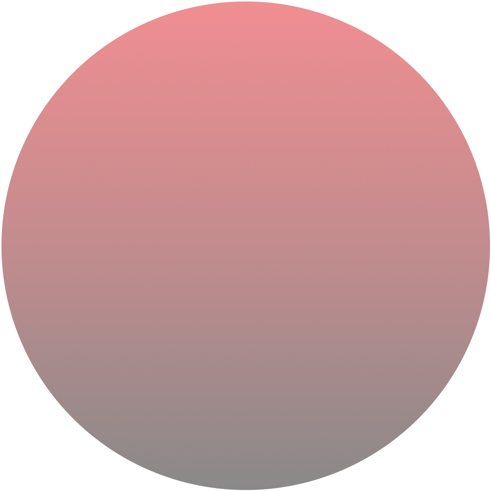

[dependencies-badge]: https://img.shields.io/david/florianmaxim/meta.svg
[dependencies-badge-url]: https://david-dm.org/florianmaxim/meta

[npm-badge]: https://img.shields.io/npm/v/meta-client.svg
[npm-badge-url]: https://www.npmjs.com/package/meta-client



# Meta.js 👩‍🚀
## Accessible Javascript Library For Virtual Reality 🚀

[![Latest NPM release][npm-badge]][npm-badge-url] [](https://travis-ci.org/florianmaxim/Meta) [![Dependencies][dependencies-badge]][dependencies-badge-url] [](https://twitter.com/metajs_org)

# 🚀 Why (did you come up with this)?

Spatial media like virtual reality or augmented reality is perceived in such a fundamentally different way than computer graphics as we know them that we need to find new ways to describe it.
This is an approach.

Furthermore this is an attempt to create the most accessible virtual reality library possible.

# 🎊 Features

* 🏖 Learn how to create and use code virtual (reality) space in minutes.
* 💐 Code Virtual Reality like its the year you live in.
* 🤹🏻 Write in the language you know with the tools you love.
* 🚀 Write one version of your code that works on any device (HTC Vive, Oculus Rift, Desktop, Mobile, etc.).
* 🏰 Grab a cube now, move a castle soon!

# 💐 Examples

### The best way to learn Meta.js is to go through the examples.

<a href="https://nodejs.org">Node.js</a> must be installed.

(If you don't know how to use the terminal watch <a href="https://www.youtube.com/watch?v=jDINUSK7rXE" target="_blank">this</a>.)

Clone a full copy of Meta.js:

```script
git clone https://github.com/florianmaxim/meta
```

Select an example:
```script
cd examples/basics.positioning
```

Run and open it in your browser:
```script
npm start
```

# 🎉 Custom

### Start within 3 minutes (via Parcel-Bundler):

You need to have Node.js (https://nodejs.org) installed.

(If you don't know how to use the terminal watch <a href="https://www.youtube.com/watch?v=jDINUSK7rXE" target="_blank">this</a>.)

1. Create a new directory and enter it.
```script
mkdir meta && cd meta
```
2. Initialize a npm repository and install Parcel-Bundler and Meta.js.
```script
npm init && npm install parcel-bundler meta-client
```
3. Create a <i>index.html</i> and a <i>index.js</i> file.
```script
touch index.html index.js
```
5. Paste the following into index.html.
```script
<html>
<body>
  <script src="./index.js"></script>
</body>
</html>
```
6. Add the following into index.js.
```javascript
import {on, Cube} from 'meta-client';

on('touch', (data) => new Cube({position:data.position});
```  
7. Start:
```script
parcel index.html
```  
Open http://localhost:1234/ in your browser.

### One Line
Alternatively you can also put all steps together in a single line like this:

```script
touch index.html index.js && echo '<html><body><script src="./index.js"></script></body></html>' >> ./index.html && echo "import {Ground, Cube, on} from 'meta-client';\nnew Ground();\non('touch', (data) => new Cube().set(data.position));" >> ./index.js && npm init -y && npm i parcel-bundler meta-client && parcel index.html
```

# 📕 Wiki

[Read the Wiki to learn how to use Meta.js.](https://github.com/florianmaxim/meta/wiki) 

# 📚 Docs

[Read the full code documentation.](https://florianmaxim.github.io/Meta)

# 💬 Slack

Join the [Slack channel](https://metajsorg.slack.com) to talk about (virtual) space.

# Packages

|                                             meta-client                                            |                                             meta-console                                             |
|:--------------------------------------------------------------------------------------------------:|:----------------------------------------------------------------------------------------------------:|
| [](https://www.npmjs.com/package/meta-client)  | [](https://www.npmjs.com/package/meta-console)  |
| [](https://www.npmjs.com/package/meta-client) | [](https://www.npmjs.com/package/meta-console) |

# Compatibility

### VR Displays

<table>
    <tr>
        <td>
            Browser
        </td>
        <td>
            Version
        </td>
        <td>
            HTC Vive
        </td>
    </tr>
    <tr>
        <td>
            <a href="https://chromium.woolyss.com/download/" target="blank">
             Chromium
            </a>
        </td>
        <td>
        67.0.3371.0
        </td>
        <td>
            
        </td>
    </tr>
    <tr>
        <td>
            <a href="https://www.google.com/chrome/" target="blank">
             Chrome
            </a>
        </td>
        <td>
            65.0.3325.162
        </td>
        <td>
            
        </td>
    </tr>
     <tr>
        <td>
            <a href="https://www.mozilla.org/en-US/firefox/nightly/all/" target="blank">
             Firefox Nightly
            </a>
        </td>
        <td>
            61.0a1
        </td>
        <td>
            
        </td>
    </tr>
</table>

### Desktop

<table>
    <tr>
        <td>
            Browser
        </td>
        <td>
            Version
        </td>
        <td>
            Status
        </td>
    </tr>
    <tr>
       <td>
            Chrome
        </td>
        <td>  
            67.0.3396.99   
        </td>
        <td>
            
        </td>
    </tr>
</table>

### Mobile

<table>
    <tr>
        <td>
            Browser
        </td>
        <td>
            Version
        </td>
        <td>
            Status
        </td>
    </tr>
    <tr>
       <td>
            Chrome
        </td>
        <td>     
        </td>
        <td>
        </td>
    </tr>
</table>

# Credits 👑

As any other software this is based on thousands of layers of programming abstraction. The upper layers on which this is build on are Three.js (Javascript 3D library) and Oimo.js (Javascript physics engine). 

# References & Inspiration 🤹

I probably learned most about space from
[<b>Walter Lewin</b>](https://www.youtube.com/watch?v=GtOGurrUPmQ "Walter Lewin").

I probably learned most about toys from [<b>Julian Summer Miller</b>](https://www.youtube.com/watch?v=F6uYDUPn4oM "Julian Summer Miller").

That's basically what brought me here.

# License 🔖
MIT

# Manifesto 📜

Let's start to redefine space!